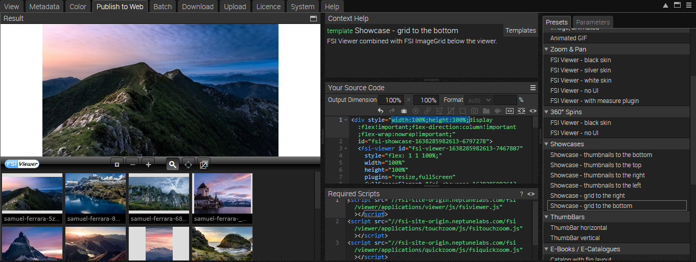
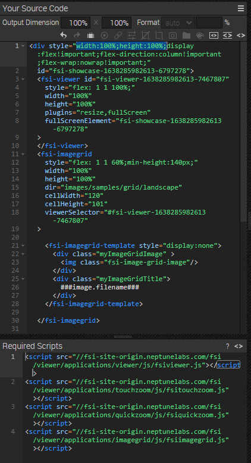

# Portfolio - Using FSI Showcase with metadata

This readme describes how to create a photographer portfolio showcase with FSI Viewer and FSI ImageGrid.
The aim of the demo is to show how you can easily integrate an image grid with metadata. If you click on an
image, a zoom modal opens.

# Add your images/ assets to FSI Server

First, you'll need to upload the images you want to use to FSI Server.
You can install a [demo version](https://www.neptunelabs.com/get/) via Docker or use our [online demo server](https://demo.fsi-server.com/fsi/interface/) to try it out first.

# Uploading images

There are several possibilities to upload images into the interface.


- Choose the Upload tab, click the "Choose files" button to add files to upload to the list. The files will be uploaded to the current folder.
- Drag & Drop files to the file view or the tree view

# Add Image Grid on the website

While having an image or folder selected, you can see all possible publishing ways for the specific item by visiting the "Publish To Web" tab.
For this example, select one image and use the preset *Image Grid with metadata* in the section *Image Grid* :



This publishes the directory with a custom <fsi-imagegrid> tag and displays a medium image grid with meta data.




The *Source Code* section enables you to control the look of your viewer by setting the dimensions and format, as well as adding effects or crop options to it.

You can set the output dimensions and format (auto automatically chooses the best format for the browser used, or you can set WEBP, JPEG, PNG or GIF).
In this area you also can see the source code for your selected publishing option which you can edit and copy to publish the images.

Here you also see the <fsi-imagegrid> tag which sets the parameters used for the zoom option.
If you click on the tag, the bar on the right automatically switches to the tab *Parameters*, enabling you to customize the ImageGrid to your liking.

# Using FSI ImageGrid

In order to display the viewer, you only need to add the corresponding scripts
to the head of your website:

```html
<script
  src='https://docs.neptunelabs.com/fsi/viewer/applications/imagegrid/js/fsiimagegrid.js'
</script>
```
This ensures that FSI ImageGrid is loaded.

Simply embed the <fsi-imagegrid> tag on the page where you want to display the grid.
In our example, this looks like this:

```html
  <fsi-imagegrid style="text-align:center;width:100%;height:100%;"
                 dir="/images/samples/grid/landscape/"
                 id="fsi-grid-fit"
                 cellWidth="300"
                 cellHeight="325"
                 useTouchZoom="true"
                 useQuickZoom="false"
                 autoCrop="cc"
                 scroll="false"
                 debug="true"
                 onCellClick="openPopUp"
>

  <fsi-imagegrid-template style="display:none">
    <div class="myImageGridTitle">
      <span>###iptc.Caption###</span>
    </div>
    <div class="myImageGridImage" >
      
    </div>
    <div class="myImageGridText" >
					<span>
						###iptc.FSI Extra###<br/><br/>
						Foto: ###iptc.Credit###<br/><br/>
					</span>
    </div>
  </fsi-imagegrid-template>
</fsi-imagegrid>
```

For all parameters which can be used, please consult the [manual](https://docs.neptunelabs.com/fsi-viewer/latest/fsi-viewer).

## Displaying metadata

In our example we have displayed some labels beneath the thumbnails in the image grid.
This is achieved by adding the following part:

```html
 <fsi-imagegrid-template style="display:none">
  <div class="myImageGridTitle">
    <span>###iptc.Caption###</span>
  </div>
  <div class="myImageGridImage" >
    
  </div>
  <div class="myImageGridText" >
					<span>
						###iptc.FSI Extra###<br/><br/>
						Foto: ###iptc.Credit###<br/><br/>
					</span>
  </div>
</fsi-imagegrid-template>
```

The div with the ImageGrid Title contains the metadata Caption, while the div with the class myImageGridText contains FSI Extra and the Credit.
In order to add this metadata, go to the tab *Metadata* and click on the three tiles on the right, selecting **Add fields**:


Tip: if you do this with multiple images selected, the fields will be added to them, making it more convenient.

We have added Caption, Credit and FSI Extra to it:


You can then type in all the information you want to display in the fields:


## Testing with examples from your own server

To test the examples with images from your own [FSI Server](https://www.neptunelabs.com/fsi-server/), please first copy the env.yml.dist file to env.yml and adapt the file, then restart the main demo again.
