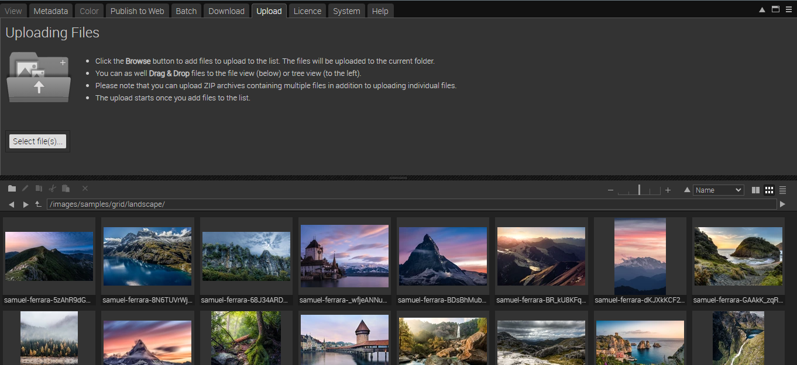
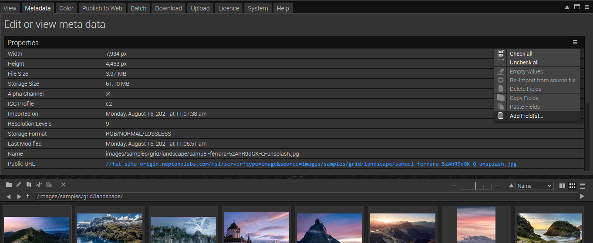
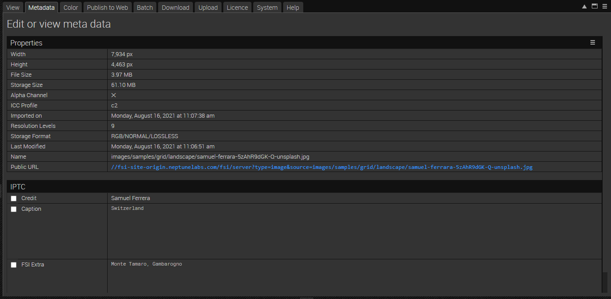

# Portfolio - Using FSI Showcase with metadata

This readme describes how to create a portfolio showcase with FSI Viewer and FSI
The aim of the demo is to show how you can easily integrate an image grid with metadata and zoom by just adding
two simple custom tags.

# Add your images/ assets to FSI Server

First, you'll need to upload the images you want to use to FSI Server.
You can install a [demo version](https://www.neptunelabs.com/get/) via Docker or use our [online demo server](https://demo.fsi-server.com/fsi/interface/) to try it out first.

# Uploading images

There are several possibilities to upload images into the interface.



- Choose the Upload tab, click the "Choose files" button to add files to upload to the list. The files will be uploaded to the current folder.
- Drag & Drop files to the file view or the tree view

# Add Showcase Zoom on the website

While having an image selected, you can see all possible publishing ways for the specific item by visting the Publish To Web tab.
For this example, select the preset *Showcase - thumbnails to the left* in the section *Showcases*:


The *Source Code* section enables you to control the look of your viewer by setting the dimensions and format, as well as adding effects or crop options to it.
In this area you also can see the source code for your selected publishing option which you can edit and copy to publish the images.
You also see the required scripts which need to be embedded on the site.


In order to display the Showcase, you only need to add the scripts listed in the **Required Scripts** field
to the head of your website:

```html
<script src="//fsi-site.neptunelabs.com/fsi/viewer/applications/viewer/js/fsiviewer.js"></script>
<script src="//fsi-site.neptunelabs.com/fsi/viewer/applications/touchzoom/js/fsitouchzoom.js"></script>
<script src="//fsi-site.neptunelabs.com/fsi/viewer/applications/thumbbar/js/fsithumbbar.js"></script>
```
This ensures that the viewers are loaded.

Afterwards, you need to place the tags you see in the Publish section on the place where you would like to see the viewer.
In our example this will look like this:

```html
<div style="width:100%;height:100%;display:flex!important;flex-direction:column!important;flex-wrap:nowrap!important;"
     id="fsi-showcase-1638202879465-5456242">
  <fsi-viewer id="fsi-viewer-1638202879466-1436698"
              style="flex: 1 1 100%;"
              width="100%"
              height="100%"
              skin="white"
              plugins="resize,fullScreen"
              fullScreenElement="fsi-showcase-1638202879465-5456242"
  >
  </fsi-viewer>
  <fsi-imagegrid
    style="flex: 1 1 60%;min-height:140px;"
    width="100%"
    height="100%"
    dir="images/samples/grid/landscape"
    cellWidth="300"
    cellHeight="125"
    useTouchZoom="true"
    useQuickZoom="false"
    autoCrop="cc"
    viewerSelector="#fsi-viewer-1638202879466-1436698"
  >

    <fsi-imagegrid-template style="display:none">
      <div class="myImageGridTitle">
        <span>###iptc.Caption###, ###iptc.FSI Extra###</span>
      </div>
      <div class="myImageGridImage" >
        
      </div>
      <div class="myImageGridText" >
      </div>
    </fsi-imagegrid-template>

  </fsi-imagegrid>

  <style>
    fsi-imagegrid .fsi-imagegrid-root .myImageGridTitle{
      padding:0 4px;
      font-size:11px;
      text-align:center;
      height:20px;
      line-height:20px!important;
      background-color:#000;
      color:#999;
      overflow:hidden;
      text-overflow:ellipsis;
      white-space: nowrap;
    }

    fsi-imagegrid .fsi-imagegrid-root div.myImageGridImage{
      height:calc(100% - 20px);
      background-color:#DDD;
    }
  </style>
</div>
```

For all parameters which can be used, please consult the [manual](https://docs.neptunelabs.com/fsi-viewer/latest/fsi-viewer).

## Displaying metadata

In our example we have displayed some labels beneath the thumbnails in the image grid.
This is achieved by adding the following part:

```html
 <fsi-imagegrid-template style="display:none">
      <div class="myImageGridTitle">
        <span>###iptc.Caption###, ###iptc.FSI Extra###</span>
      </div>
      <div class="myImageGridImage" >
        
      </div>
      <div class="myImageGridText" >
      </div>
    </fsi-imagegrid-template>
```

The div with the ImageGrid Title contains the metadata Caption and FSI Extra.
In order to add this metadata, go to the tab *Metadata* and click on the three tiles on the right, selecting **Add fields**:



Tip: if you do this with multiple images selected, the fields will be added to them, making it more convenient.

We have added Caption and FSI Extra to it:


You can then type in all the information you want to display in the fields:



## Testing with examples from your own server

To test the examples with images from your own [FSI Server](https://www.neptunelabs.com/fsi-server/), please first copy the env.yml.dist file to env.yml and adapt the file, then restart the main demo again.
