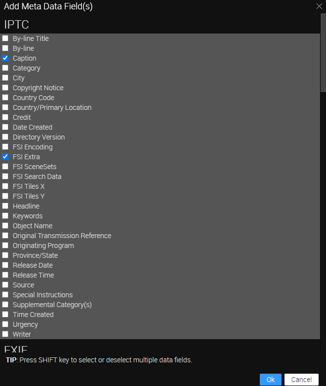

# Portfolio - Using FSI Showcase with metadata

This readme describes how to create a photographer's portfolio showcase using FSI Viewer and FSI ImageGrid.
The aim of the demo is to show how you can easily integrate an image grid with metadata.
Clicking on an image will open a zoom modal.

# Using FSI ImageGrid

To display the viewer, all you need to do is add the following scripts
to the head of your website:

```html
<script
  src='https://docs.neptunelabs.com/fsi/viewer/applications/imagegrid/js/fsiimagegrid.js'
</script>
```

This will ensure that FSI ImageGrid is loaded.

Simply include the <fsi-imagegrid> tag in the page where you want to display the grid.
In our example, it looks like this:

```html
<fsi-imagegrid
  style="text-align:center;width:100%;height:100%;"
  dir="/images/samples/grid/landscape/"
  id="fsi-grid-fit"
  cellWidth="300"
  cellHeight="325"
  useTouchZoom="true"
  useQuickZoom="false"
  autoCrop="cc"
  scroll="false"
  debug="true"
  onCellClick="openPopUp"
>
  <fsi-imagegrid-template style="display:none">
    <div class="myImageGridTitle">
      <span>###iptc.Caption###</span>
    </div>
    <div class="myImageGridImage">
      
    </div>
    <div class="myImageGridText">
      <span>
        ###iptc.FSI Extra###<br /><br />
        Foto: ###iptc.Credit###<br /><br />
      </span>
    </div>
  </fsi-imagegrid-template>
</fsi-imagegrid>
```

For all the parameters that can be used, please refer to the [manual](https://docs.neptunelabs.com/fsi-viewer/latest/fsi-viewer).

## Displaying metadata

In our example, we have added some labels below the thumbnails in the image grid.
This is achieved by adding the following part:

```html
<fsi-imagegrid-template style="display:none">
  <div class="myImageGridTitle">
    <span>###iptc.Caption###</span>
  </div>
  <div class="myImageGridImage">
    
  </div>
  <div class="myImageGridText">
    <span>
      ###iptc.FSI Extra###<br /><br />
      Foto: ###iptc.Credit###<br /><br />
    </span>
  </div>
</fsi-imagegrid-template>
```

The ImageGrid Title div contains the Caption metadata, while the myImageGridText div contains FSI Extra and the Credit.
To add this metadata, go to the _Metadata_ tab, click on the three tiles on the right and select **Add Fields**:


Tip: If you do this with multiple images selected, the fields will be added to them, making it more convenient.

We have added Caption, Credit and FSI Extra:



You can then enter any information you wish to display in the fields:


## Testing with examples from your own server

To test the examples with images from your own [FSI Server](https://www.neptunelabs.com/fsi-server/), please first copy the env.yml.dist file to env.yml and adapt the file, then restart the main demo again.
