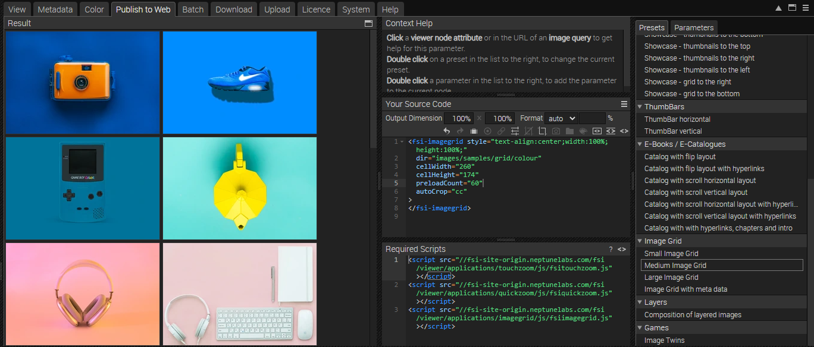
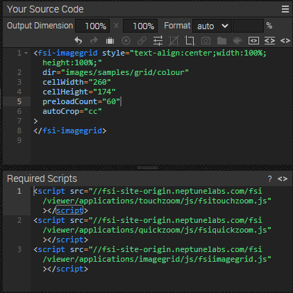
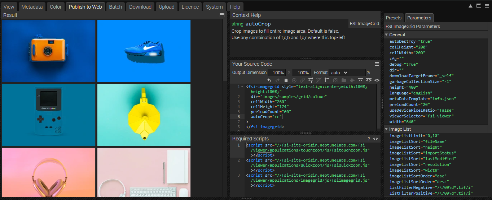

# Frontpage - Using a product grid for featured products

This readme describes how the product grid page example is achieved using _FSI Imagegrid_ from _FSI Server_.
The aim of the demo is to show how you can easily integrate the viewer.
You will also learn how to add metadata to images.

With an image or folder selected, you can see all the possible publishing options for that particular item by going to the "Publish to Web" tab.
For this example, select an image and use the _Medium Grid_ preset in the _Image Grid_ section:



This will publish the directory with a custom <fsi-imagegrid> tag and display a medium image grid.



The _Source Code_ section allows you to control the appearance of your viewer by setting the dimensions and format, as well as adding effects or cropping options.

You can set the output dimensions and format (Auto automatically selects the best format for the browser used, or you can set WEBP, JPEG, PNG or GIF).
This area also displays the source code for your chosen publishing option, which you can edit and copy to publish your images.

Here you can also see the <fsi-imagegrid> tag, which sets the parameters used for the zoom option.
When you click on the tag, the right hand bar automatically switches to the _Parameters_ tab where you can customise the ImageGrid to your liking.



For all the parameters that can be used, please refer to the [manual](https://docs.neptunelabs.com/fsi-viewer/latest/fsi-imagegrid).

# Using FSI ImageGrid

To display the viewer, all you need to do is add the following scripts to the head of your website:

```html
<script
  src='https://fsi.domain.tld/fsi/viewer/applications/imagegrid/js/fsiimagegrid.js'
</script>
```

This will ensure that FSI ImageGrid is loaded.

Simply include the <fsi-imagegrid> tag in the page where you want to display the grid.
In our example it looks like this:

```html
<fsi-imagegrid
  style="text-align:center;width:100%; height:1000px;"
  dir="images/samples/grid/colour"
  cellWidth="220"
  cellHeight="220"
  preloadCount="60"
  autoCrop="cc"
  scroll="false"
>
</fsi-imagegrid>
```

## Testing with examples from your own server

To test the examples with images from your own [FSI Server](https://www.neptunelabs.com/fsi-server/), please first copy the env.yml.dist file to env.yml and adapt the file, then restart the main demo again.
